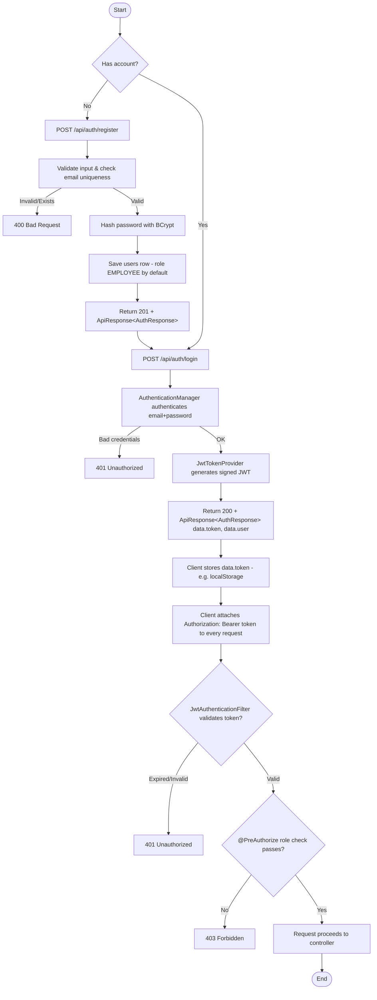
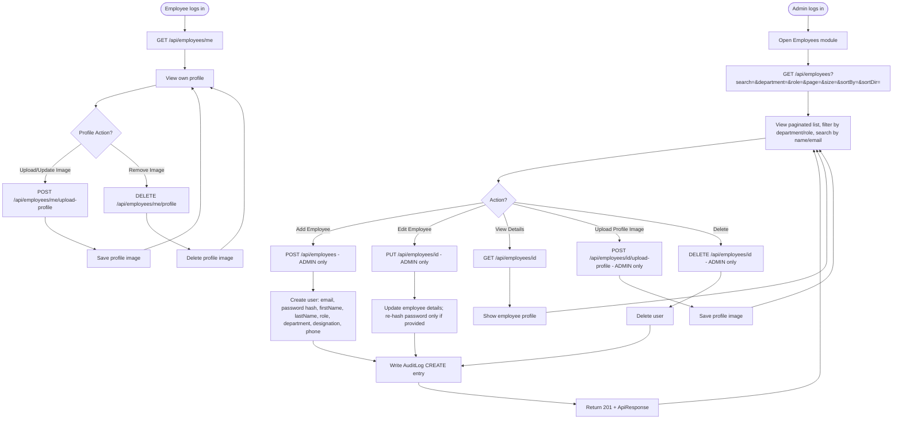
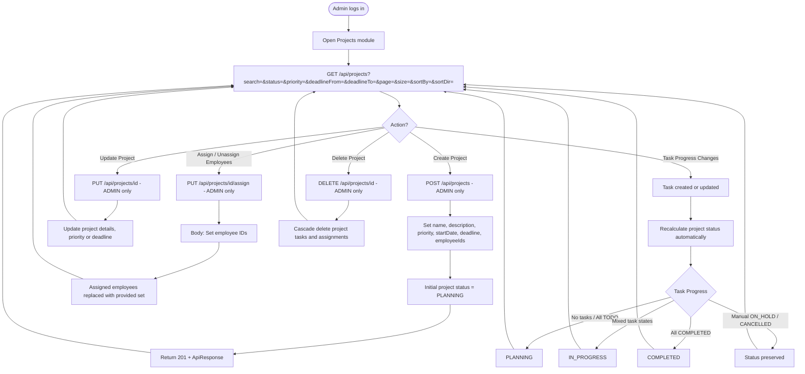
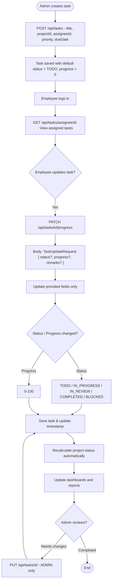
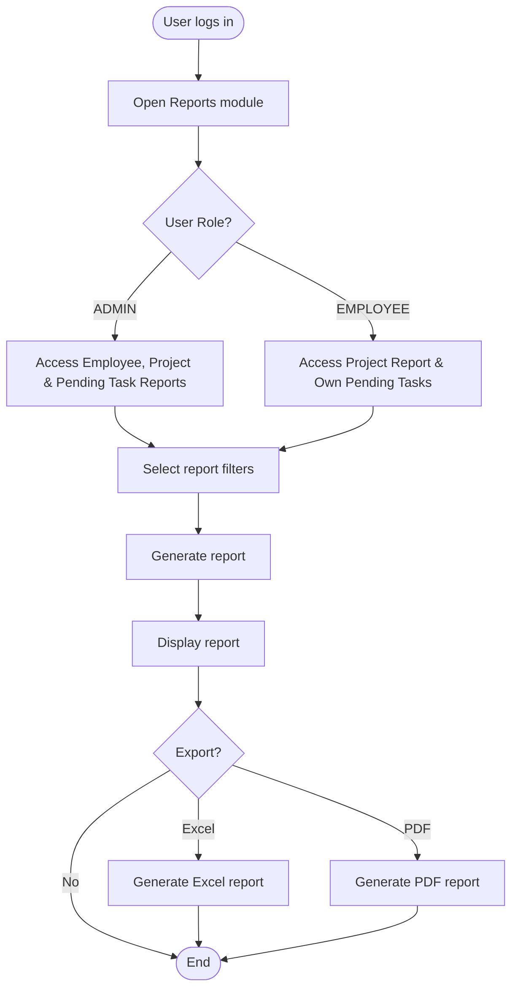
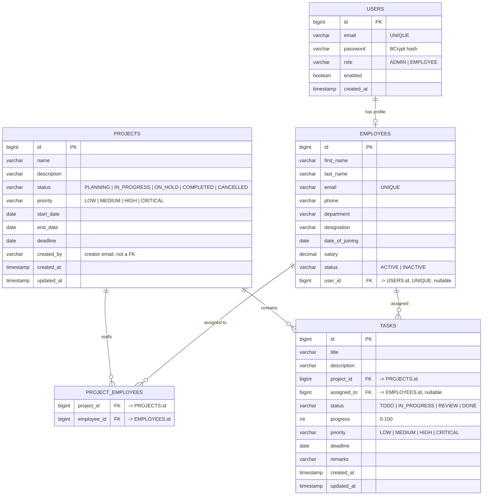

# Flowcharts & Diagrams

This document visualizes the major flows in the Smart Employee & Project
Management System. All diagrams are written in [Mermaid](https://mermaid.js.org/)
and render automatically on GitHub, GitLab, and in most Markdown previewers
(including the Cursor/VS Code Markdown preview).


## Table of Contents

1. [Authentication Flow](#1-authentication-flow)
2. [Employee Management Flow](#2-employee-management-flow)
3. [Project Management Flow](#3-project-management-flow)
4. [Task Management Flow](#4-task-management-flow)
5. [Reports Flow](#5-reports-flow)
6. [API Request Flow (Layered Architecture)](#6-api-request-flow-layered-architecture)
7. [Database ER Diagram](#7-database-er-diagram)

---

## 1. Authentication Flow



---

## 2. Employee Management Flow




---

## 3. Project Management Flow



---

## 4. Task Management Flow



---

## 5. Reports Flow



---

## 6. API Request Flow (Layered Architecture)

End-to-end path of a typical authenticated request through the Spring Boot
backend, e.g. `GET /api/employees/5`.

```mermaid
sequenceDiagram
    autonumber
    participant C as Client (React SPA)
    participant F as JwtAuthenticationFilter
    participant Ctrl as Controller<br/>(EmployeeController)
    participant Svc as Service<br/>(EmployeeService)
    participant Repo as Repository<br/>(UserRepository / JPA)
    participant DB as MySQL / H2

    C->>F: HTTP GET /api/employees/5<br/>Authorization: Bearer <JWT>
    F->>F: Validate JWT signature + expiry
    F->>F: Load UserDetails, set SecurityContext
    F->>Ctrl: Forward request (authenticated)
    Ctrl->>Ctrl: @PreAuthorize role check (if present)
    Ctrl->>Svc: employeeService.getById(5)
    Svc->>Repo: userRepository.findById(5)
    Repo->>DB: SELECT * FROM users WHERE id = 5
    DB-->>Repo: Result set (1 row)
    Repo-->>Svc: User entity (or empty Optional)
    Svc->>Svc: EntityMapper.toUserResponse(user)
    Svc-->>Ctrl: UserResponse
    Ctrl-->>F: ResponseEntity 200 OK + ApiResponse&lt;UserResponse&gt;
    F-->>C: HTTP 200 OK (application/json)

    Note over Ctrl,Svc: On error (not found, validation, duplicate email, etc.)<br/>GlobalExceptionHandler maps exceptions to a standardized<br/>ApiResponse.error(...) body (400/401/403/404/500).
```

---

## 7. Database ER Diagram

This diagram represents the database schema used by the Smart Employee & Project Management System.


